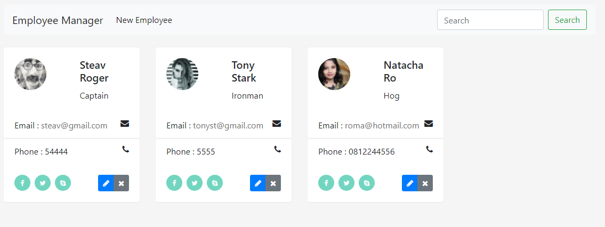
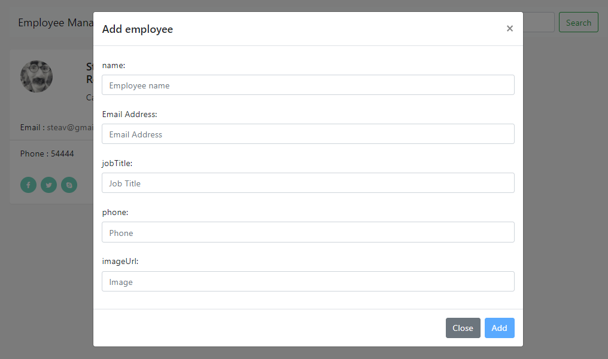
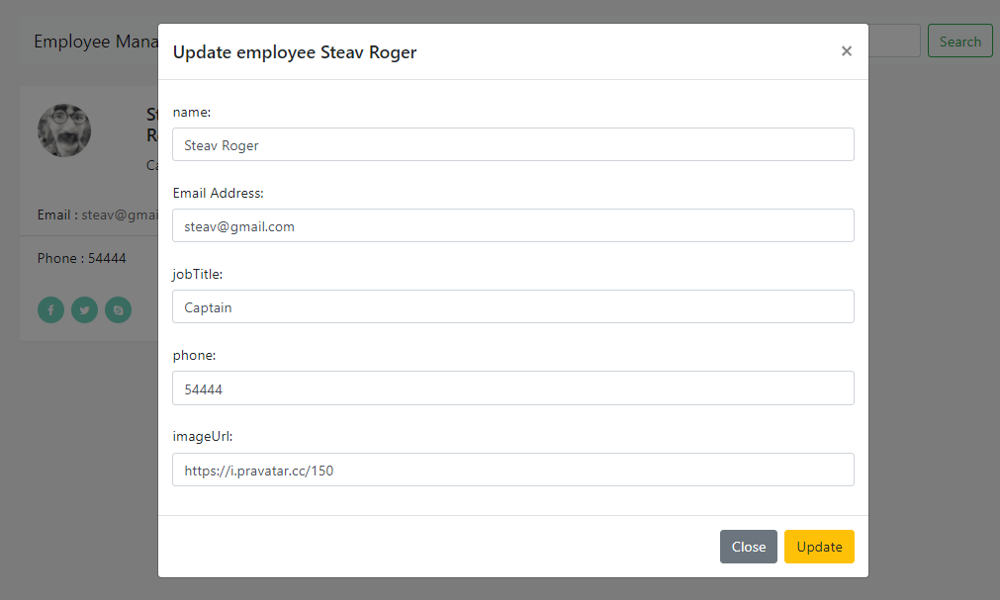
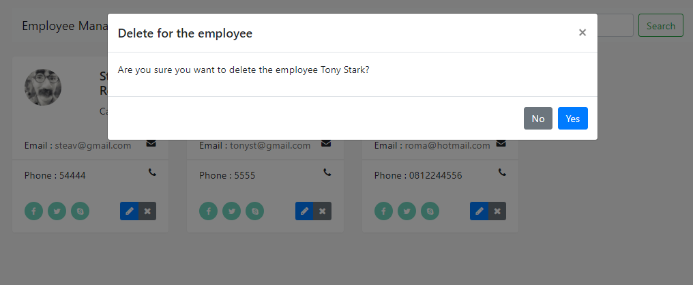

## Angular and Spring Boot CRUD Example
  Angular 11 Frontend and used for
  Spring Boot 2.5.2 with OpenJDK 11 to the backend and used for
  PostgreSQL with JPA for database and ORM mapping.

## List all the employee

## Add Employee

## Edit Employee

## Delete Employee

## Search each employee

